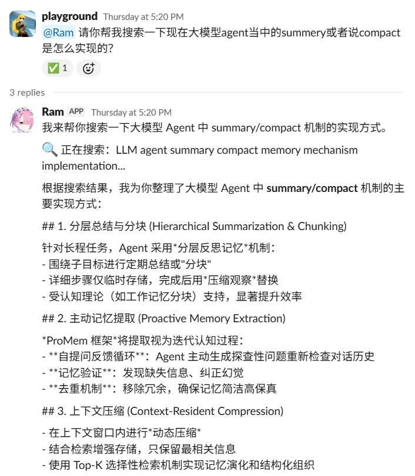
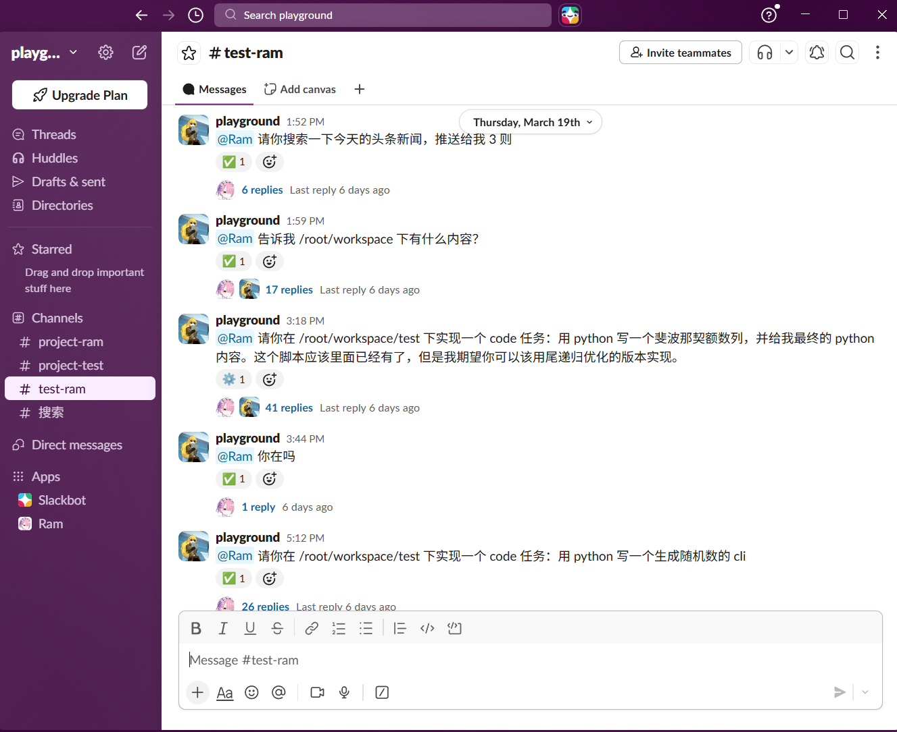
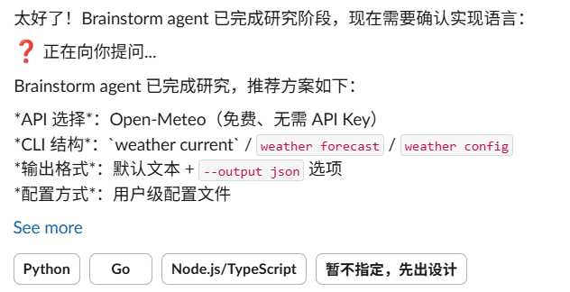
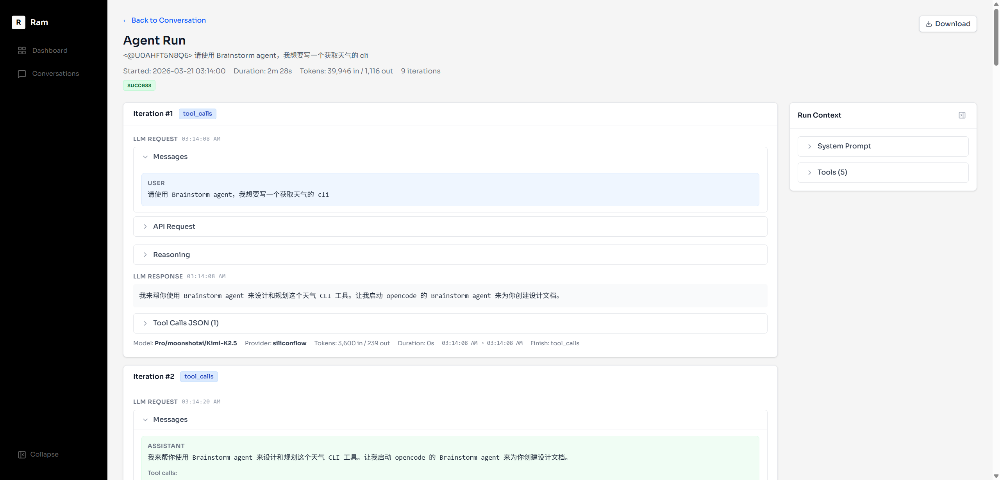

+++  
title = "Ram：Slack AI agent 开发日志"  
date = "2026-03-25"

[taxonomies] tags=["AI"]

[extra]  
comment = true  
+++

> 这篇文章介绍的是 [Hikaru518/Ram](https://github.com/Hikaru518/Ram)，欢迎阅读和试用！

我在 [一个属于我的软件开发 Agentic 工作流](@/posts/my-opencode-agentic-workflow.md) 提到："有好几次，我都正处于写代码到快完成的时候，而"不得不出门"这件事就让我很痛苦。那时候我就会想，要是有一个可以用手机操作，使用聊天就可以进行的 coding agent。"

从 3 月 15 日开始，我每天会抽出几个小时，开发了十天左右，最后的结果就是 [Hikaru518/Ram](https://github.com/Hikaru518/Ram)。

这篇文章就是对于 Ram 的介绍，以及一些开发时的心路历程和杂谈。

# Ram 介绍

首先，这是 Ram 在 slack 中的一个截图。

{width="335"}

如图所示，Ram 是一个 Slack 中的 AI Agent，可以在 Slack 根据我的请求进行回答。因为整个 Slack 工作区中只有我一个人，你也可以认为 Ram 就是一个数字助手。

Ram 的主体是一个跑在阿里云 ECS 上的一个后端服务。主体是一个装备了许多工具的 Agent Loop。整个框架是从零开始构建的，到现在为止我实现了 Ram 的下面功能：
- **搜索**。Ram 可以使用 [tavily](https://www.tavily.com/) 进行网络搜索。
- **代码开发**。Ram 内置了 [opencode-config](https://github.com/Hikaru518/opencode-config) 这个工作流，使用 opencode cli 的无头模式进行代码编写。关于 opencode-config，详见我之前的博客 [一个属于我的软件开发 Agentic 工作流](@/posts/my-opencode-agentic-workflow.md)。
- **项目管理**。Ram 提供项目管理能力，可以将 slack 的频道绑定为项目。这里的“项目”是指代码项目，可以在这个项目中进行代码编写。
- **国内部署友好**。部署在阿里云中，可以在 2c2g 的 ecs 中工作。
- **可追踪性**。提供详细和完整的日志服务和 trace 记录。提供漂亮的 trace 界面，并且可以以 markdown 形式下载 trace 和消息功能。
- **保留 Prompt 历史**。本项目由 AI 进行代码编写，在 docs 中记录了每次的 prompt 记录。

下面来具体聊聊。

## 代码开发

我的想法是，OpenCode 的代码能力已经很强了，而且我有一个自己开发的 opencode 工作流程。我要做的仅仅是让 Ram 来唤起和管理不同的 OpenCode Session，并适配我的 opencode 工作流。因此主要的调用链路就是：
```text
我在 Slack 发消息 -> Ram 在服务器上收到消息 -> 在相应目录调用 OpenCode CLI
```

为此，我需要让 Ram 有一些最基本的 bash 指令功能。她可以查看和列出文件（以得知不同的工作区的内容，并且移动到不同的工作区），但是我不希望她直接完成编程工作（这部分应该交给 OpenCode）。在这个基础上 Ram 就衍生出了一个 Bash Tool 的功能，但这个 Bash Tool 指令比较受限，我在 prompt 和 allowlist 中都限制了 bash 能做的功能。

另一个问题是 Session 管理，我可能会有多个项目在开发。由于 OpenCode 自带了 session 管理，我需要做的仅仅是把 Project 绑定在 Channel 中，不同的 Session 绑定在不同的 Thread 中。

顺便一提，选择 Slack 是因为我认为 Slack 的机制非常适合 LLM Agent。如图所示，每一个 Slack Thread 天然就是一个 LLM conversation session，而每一个 channel 可以作为一个 project space 用于区分不同的项目（或者功能）。

{width="540"}

继续回到代码开发的问题。另一个我没想到的问题是 OpenCode 的 headless 模式。我调研的时候发现 opencode 有 CLI 模式我就认为万事大吉了。但我没想到的是 OpenCode 在 CLI 模式下不支持 Question Tool，并不会向用户提问。在测试中，如果直接在 cli 中要求使用 Quesiton Tool，OpenCode 甚至会不响应。由于我的 OpenCode-Config 中有大量的用户访谈环节，我需要让他用自然语言输出问题。

这个问题的解决办法是我在 opencode-config 中加入了一个[无头模式](https://github.com/Hikaru518/opencode-config?tab=readme-ov-file#headless-%E6%A8%A1%E5%BC%8F)。我做好了最坏的打算：需要写一个新的 OpenCode Question Tool，结果一个 system instruction 就解决了。

最终会达到下面的效果




## 搜索功能

搜索功能也就是 WebFetch 和 WebSearch 功能。WebFetch 用于获取某一个具体的网页内容（给一个 url，然后把内容用 markdown 返回）。

搜索服务用于搜寻某一个特定的问题，我接入的服务商现在是 [tavily](https://www.tavily.com/) ，未来考虑接入 [exa](https://exa.ai/)。这两个的区别是我认为 exa 更适合代码的研究。

## 完整的日志服务和 trace 记录。

我花了很多时间构建 trace 记录和日志。我有两点考虑。

一是处于 debug 和 evaluation 的考虑。对于一个 agent 来说，一轮 agent loop 会产生好多个工具调用，我需要明确知道它在每一轮的输入输出。很自然的，因为 debug 也是我提供内容给 coding agent 进行 debug，我还提供了以 markdown 形式下载 trace 的功能。

Trace 同时也是 evaluation 的基础。虽然我对于 "如何对 Agent 的工作成果进行 Evaluation" 这个问题还在探索中，但是一个好的 trace 系统是 evaluation 的工程基础。



另一方面，我认为一个个人助手可以天然的管理和统一我的所有 AI 聊天场景。如果我的所有代码和聊天都通过 Ram 进行，那么他会知道我的所有兴趣点。当我存储了所有的聊天对话（OpenCode 对话，搜索对话等等），那么一个 Agent 记忆的资料就有了。因此要做记忆系统，一个好的存储系统也是不可或缺的，而这个数据库这和 trace 系统存储的数据非常相似。

## Prompt 历史和 Design Doc

我在 Ram 这个开源项目中提供了非常完整的 Prompt 和 design 历史，保存在 `docs/plans` 中。这里面甚至记录了我对 Ram 的设计变更，也有我和 LLM 讨论的细节记录。

保存和上传这些内容到代码库出于两点考虑：
1. **既然代码是 LLM 写的，那么 Prompt 和 design 是需要被维护的内容**。一方面，我们可以通过 prompt 和 design 来让一个 Coding Agent 完全重写这么一个项目。另一方面，这些内容可以用作 coding agent 在 AGENTS.md 内容缺失时的一个最重要的参考，是 planning with files 的重要材料。
2. **人类可以阅读和参考记录这个项目的设计文档和历史**。而我认为这恰恰是 AI 时代开源项目需要提供的。给人代码不如给人 prompt 和设计。

## 阿里云部署

我现在的 Ram 实例部署在阿里云中，可以在 2c2g 的 ecs 中工作。我选阿里云的主要原因是……阿里云的 99 元包年 ecs 套餐实在是太便宜了。

但是一个国内的 ECS 实例也带来了一些额外的工作，例如：
- 我需要寻找可以在国内使用的搜索工具和 LLM api。
- 域名的 ICP/公安备案。备案的速度比我想象中快很多，据 wsy 说他十年前备案用了一个月，而我一个工作日就完成了备案。

我没有想到的是一个 Agent Loop 占用的资源是如此小。我唯一一次资源不够是因为 OpenCode 在写一个递归的时候 CPU 爆炸了。但 OpenCode 有 CPU 使用量过大的问题，我会在之后再关注一下资源量的问题。

# 接下来可能的方向

我认为 Agent 接下来有意思的方向，同时也是我感兴趣的方向有两个：
1. Agent 的记忆。如何让 Agent 记住之前的对话？
2. Evaluation 和 Benchmark。如何对 Agent 进行评估？

我有一些非常初步的想法，这些想法都还没有进入深入的研究，只是初步的 idea，但是还是在此简短记录一下。

## Evaluation 和 Benchmark

如何对 Agent 进行评估呢？Agent 之前的软件工程往往是一些功能的集合：例如按下某个按钮，会发生什么。评估的方法是单元测试和集成测试。

但是 Agent 有点不一样。一个 Agent 在解决一些更复杂的、undefined 的问题。例如：我告诉 AI Agent，你需要做一个网页，那么网页的前端视觉就涉及到了审美（而非对错）。即使我告诉他我的审美倾向——我可以说我喜欢现代的扁平化设计——那么我又如何自动化地检验他是否应用了我告知的 principle？

让我觉得有意思的是：这个 Agent 的学习过程是否像是一个教育问题？一个 LLM 本身是没有偏好和观点的，他在我的 prompt 输入之前是一张白纸，他的偏好和价值判断是我灌输给他的。那么我应该如何检验他"学会了"这些偏好和观点？

我想到的另一件事情是推荐系统，推荐系统的目标是"让大家都能找到自己喜爱的内容"。这同样是一个抽象的目标，但是他们定义了一些指标（例如 **精确率 (Precision@K)**：前K个推荐中用户喜欢的比例）来刻画这个目标。而 Anthropic 的文章 [Demystifying evals for AI agents](https://www.anthropic.com/engineering/demystifying-evals-for-ai-agents) 中同样也提到了两个指标：
- [**pass@k**](https://proceedings.neurips.cc/paper/2019/file/7298332f04ac004a0ca44cc69ecf6f6b-Paper.pdf) "在 k 次尝试中，至少有一次正确结果"的概率。
- [**pass^k**](https://arxiv.org/abs/2406.12045) "在 k 次尝试中，k 次全部成功"的概率。

## Agent 的记忆

我一直在使用 [perplexity](https://www.perplexity.ai/) 作为 AI 搜索的入口。有一次，我在一个新的 session 中和 perplexity 聊 AI 工作的问题，他突然问我："您是否要找 AI 相关的工作？我知道你有理工科的数学背景，对 RAG 系统很感兴趣……"

他对我工科的数学背景这部分是对的，但是我对 RAG 其实没什么研究，我只知道个大概但是没有动手实现过。他这么认为是因为我曾经把几个 github 项目扔给他然后和他进行了好几轮对话。但是这个对话还是惊艳到了我。我开始思考 Agent 的记忆到底是什么。

我认为 Agent 的记忆主要分为三个方面：
1. 如何刻画用户。
2. 如何刻画 Agent。
3. Agent 应当如何取得合适的聊天历史（或者总结信息）。

第一个问题"如何刻画用户"尤其关键而且困难。假设用户是我，那这无异于对自己的思维模式进行显式的建模和分析。这可能涉及到认知科学、心理学等等问题。如果你需要的是一个陪伴性的聊天 agent，还需要分析一个人的性格、社交风格等等。

Elys 是一个 AI 社交软件（最近似乎很火），你可以在这个社交软件上创建一个 AI 分身，他会一开始采访你，问你的性格，做事方式，最近关心什么等等，来学习你在社交网络上的倾向。并且录制你的声音，生成你的虚拟形象。然后你会进入一个类似于微博的广场。会有人类发帖子，这个帖子可能像朋友圈一样说自己出门旅游，也可能是一些技术简介。然后这个帖子下就会有 AI 分身进行回帖，也就是说，想象一下你发了一个朋友圈，然后你的好友们虽然可能没有时间和机会看，但是他的 AI 代表来给你点赞和评论了。

根据 Elys 创始人的 [访谈](https://zhuanlan.zhihu.com/p/2013321262341055393) 和 [论文](https://arxiv.org/html/2603.00552v1)，他们为 agent 的记忆机制设计了 128 个槽位。

> 如果有人问我：「Tristan，你要不要来北京跟我吃顿饭？」当我收到这个 query 的时候，AI 可能会立即检视这些槽位，里面可能有 32 个与这种对话非常有关系。它可能涉及到我们俩之前的一些过往对话，可能涉及到北京当时的天气，也可能涉及到我下周要去滑雪。你会发现这些东西都跟 query 毫无关系，但它却是我当前回答这个问题所完全必要的东西。
> ——《对话 Elys 创始人 Tristan：人的灵魂是所有 context 的总和，我们从未被真正连接过》

我有一个非常初步的设想，也许我们可以设计出一系列的维度来刻画一个人在某方面的表现。例如对于一个社交 agent 来说，我们可以有"内向 vs 外向"，"资本主义 vs 社会主义"，"高风险偏好 vs 低风险偏好"等等的不同的维度，对于每一个维度会生成一个 markdown 描述文件，不同维度的问题的文件就构成了一个 character space。

另一个对我有所启发的是和 cz 的聊天。我概述一下他的想法：

cz 想要把自己的工作流进行自动化，我的解决方案是写了一个 opencode-config，用我个性化的工作流程来自动化工作流。而 cz 的方法是希望创造一个自己的 AI 分身，把价值观告诉 AI。例如他认为什么东西是有价值的（没有价值的），如何判断一个项目的好坏，自己的审美偏好和价值判断……

在此基础上，他的 AI 分身就可以代替他来进行项目研究、代码编写，这个 AI 分身可以指挥 claude code 写代码，写报告。按照他的比喻，这个 “CZ Loop” 就是一个自动化的工作流。

这让我意识到，所谓的记忆问题不仅仅是记忆问题，而是"如何塑造一个有观点的 Agent"的问题。如果可以解决这个问题，那么我们不仅是创造一个好的聊天机器人，而可以真正解决生产力和生产流程问题：因为如果我们可以刻画一个人如何在社交场合进行价值判断和决策倾向，那么我们也可以刻画一个人在工作上的技术审美和观念判断。

# 番外小剧场
1. 我在设计前端页面的时候用的是 [pencil.dev](https://www.pencil.dev/)，非常好用。
2. cz 的 Agent 分身系统的一个开源项目：[zccz14/OpenFluctLight](https://github.com/zccz14/OpenFluctLight)。希望大家可以在摇光培育出自己的 Alice... 
3. 黄老板最近在做一个自动生成 AI 短剧的项目：[wddxh/ShortVideoDirector](https://github.com/wddxh/ShortVideoDirector)，这个项目给我带来了很多欢乐。生成的 AI 漫剧太好笑了（虽然我现在没等来我想要的短剧续集）。但是和黄老板讨论的过程中我又一次认识到 AI Agent 中的 domain knowledge 是不可缺少的。

--

2026 年 3 月 25 日
